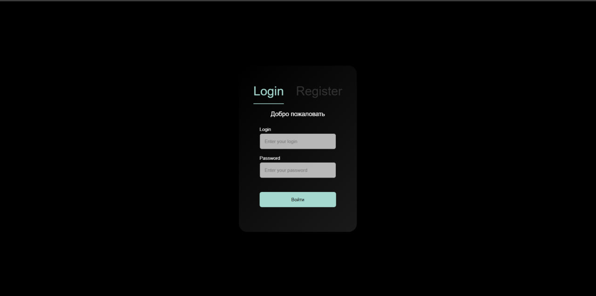

# JWT авторизация
### 1. Скачайте и установите зависимости для всех частей приложения
+ В корневой директории находится серверная часть, в которой реализованы API (Laravel)
+ В директории react находится frontend часть приложения, реализованая с помощью react + vite
### 2. Конфигурация БД
+ В файле ***.env*** поменяйте название базы на собственное (либо же создайте с таким же названием)
+ Примените миграции для создания таблиц данными с помощью команды ``` php artisan migrate ```

### 3. Запуск
+ Для запуска серверной части в конревой папке (backend) выполните команду  
``` php artisan serve ```
+ Для запуска frontend части перейдите в директорию с фронтендом и запустите команду в новом терминале
    + Переход в директорию с фронтом: ```cd react ```
    + Запуск frontend части приложения: ```npm run dev ```

### 4. Тестирование 
После запуска вашего приложения итоговый вид страницы должен выглядеть вот так (страница авторизации):

После успешного запуска создайте пользователя с помощью регистрации. После проведения успешной операции перед вами откроется главная страница, где определяется пользователь.

